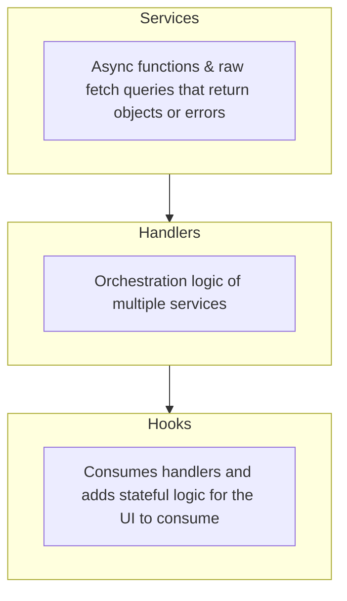

## How to write async services for React

The best way I've found to write my async logic is in what I call the **Service Handler Hook** pattern. The design looks like this:



:::note
Hooks work best with [React Query](https://tanstack.com/query/latest) and this guide was written with it as the primary way to fetch data at the UI layer.
:::

### Services

Services are usually functions that return promises with data and usually are what contact your API via fetch (or your preferred method). They will optionally take in an object as its **only parameter**, this parameter will be referred to as the _contract_ in this guide. For example here is a create service that reaches out to the API and creates a new data entry:

```typescript title="create.ts"
export default async function create(data: CreateRequest) {
  try {
    const res = await fetch("/api/create", {
      method: "POST",
      body: JSON.stringify(data),
    });

    if (!res.ok) {
      throw new Error(res.statusText);
    }

    const json: CreateRequest = await res.json();
    return json;
  } catch (error) {
    throw error as Error;
  }
}
```
